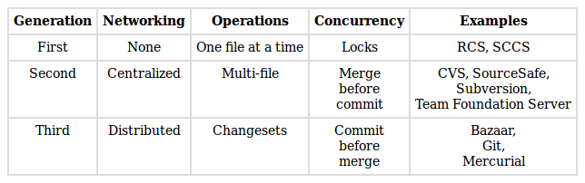
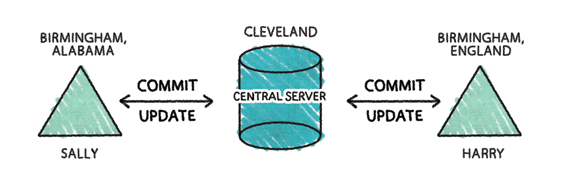
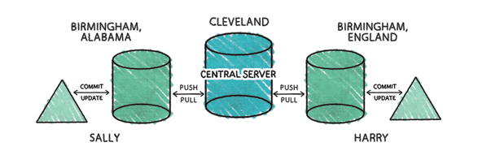
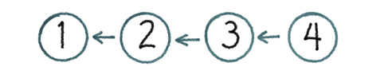
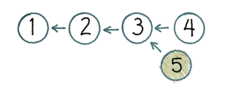
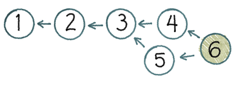
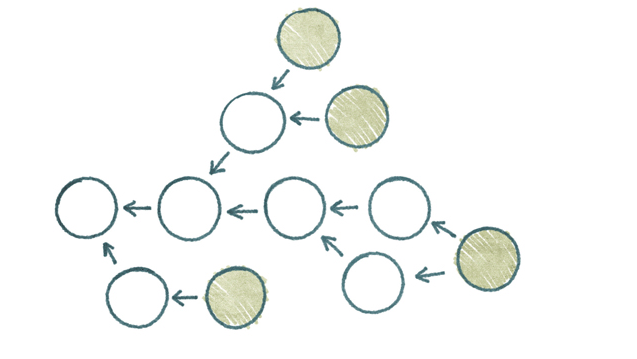
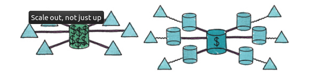

**Source: http://ericsink.com/vcbe/html/index.html**

## Chapter 1. Introduction

A version control system is a piece of software that helps the developers on a 
software team work together and also archives a complete history of their work.

There are three **basic goals of a version control system** (VCS):
* We want people to be able to work simultaneously, not seriall
* When people are working at the same time, we want their changes to not 
conflict with each other
* We want to archive every version of everything that has ever existed — ever

## A History of Version Control

Broadly speaking, the history of version control tools can be divided into 
three generations

---

## Part I. Centralized Version Control

In a CVCS, the repository exists in one place on a central server. 
Every piece of software that is used to access the repository includes a network client

* Create - Create a new, empty repository
* Checkout - Create a working copy
* Commit - Apply the modifications in the working copy to the repository as a 
new changeset
* Update - Update the working copy with respect to the repository
* Add - Add a file or directory
* Edit - Modify a file
* Delete - Delete a file or directory
* Rename - Rename a file or directory
* Move - Move a file or directory
* Status - List the modifications that have been made to the working copy
* Diff - Show the details of the modifications that have been made to the working copy
* Revert - Undo modifications that have been made to the working copy
* Log - Show the history of changes to the repository
* Tag - Associate a meaningful name with a specific version in the repository
* Branch - Create another line of development
* Merge - Apply changes from one branch to another
* Resolve - Handle conflicts resulting from a merge
* Lock - Prevent other people from modifying a file

---
## Part II. Decentralized Version Control

In contrast, a DVCS allows the repository to exist in more than one place. We can have multiple repository instances. Of course, having more than one instance of the repository means that we will need ways of keeping them synchronized.

In practice, virtually all DVCS teams have a central server. With a CVCS, a central server happens because it is inherent in the centralized model. With a DVCS, a central server happens because of the team’s decision to have one. 

* Clone - Create a new repository instance that is a copy of another.
* Push - Copy changesets from a local repository instance to a remote one.
* Pull - Copy changesets from a remote repository instance to a local one.

### Directed Acyclic Graphs (DAGs)

In order to support the ability to push and pull changesets between multiple instances of the same repository, we need a specially designed structure for representing multiple versions of things. The structure we use is called a Directed Acyclic Graph (DAG), a design which is more expressive than a purely linear model. The history of everything in the repository is modeled as a DAG.

The linear model of history won’t allow me to create version 5

Instead, a linear history VCS requires me to take the changes which were made between versions 3 and 4 and apply them to my version. The result is that my working copy’s parent gets changed from 3 to 4, thus allowing me to commit.

The obvious question is: What would happen if we allowed 5 to be checked in with 3 as its parent? Our history would no longer be a line. Instead it would be a Directed Acyclic Graph (DAG).

A DAG is a data structure from computer science which can be used to model a wide variety of problems. The DAG consists of the following elements:
* Node
* Edges
* Root node
* Leaf node

A major feature of the DAG model for history is that it doesn’t interrupt the developer at the moment he/she is trying to commit her work

The tools that use a DAG model of history provide a way to resolve the mess. The answer is the same as it is with linear history. We need a merge. But instead of requiring the developer to merge before committing, we allow that merge to happen later.

Order has been restored. Once again we know which version is “the latest”. If somebody bothers to reboot the project manager, he will probably realize that this DAG looks almost like a line. Except for that weird stuff happening between versions 3 and 6, it is a line. Best not to lose sleep over it.

Typically, a DVCS will warn you if you are attempting a push which would make the remote repository’s DAG messy. Users of Mercurial and Veracity would typically handle this situation by doing a pull, then a merge, and then retrying the push. 

Git users often handle this situation differently, using Git’s rebase feature. Rebase is a way of rewriting changesets, replacing them with new ones that are exactly equivalent but which have different parents. The way this feature is typically used is to rewrite DAG history as a line. In other words, even though Git is clearly a third generation version control tool, many of its users prefer the cleaner, linear history of a second generation tool.

## Advantages

With obvious exceptions like furniture and Star Wars movies, new things tend to be better than old things. The state of the art advances. An industry’s more recent offerings usually incorporate better technology and practices.

### Private Workspace
The most productive developer is alone. A solitary developer never has to worry about coordinating with anyone else. But as soon as the project goes plural, there is overhead.
And for every developer added to the team, the overhead gets worse.

### Fast
Developers usually don’t realize how fast a DVCS can be until they’ve tried one—stuff is really, really fast when most of your operations are against a local repository instance instead of a server.

### Offline

We’ve never had more Internet than we have right now, and we still don’t have enough. There may come a time when offline operation is no longer an important part of the DVCS story, but that time is not yet here.

### Geography

### Flexible Workflows

### Easier Merging

Branching is easy. Merging is hard. Decentralized tools are much better at merging.

* They’re built on a DAG
* They keep the developer’s intended changes distinct from the merge she had to do in order to get those changes committed.
* They deal with whole-tree branches, not directory branches.

### Implicit Backup

### Scale out, not just up

Generally speaking, a DVCS has much more modest hardware requirements for a central server. Users don’t interact with the server unless they need to push or pull. All the heavy lifting happens on the client side so the server hardware can be very simple indeed. 

## Weaknesses

### Locks
### Very Large Repositories
### Integration
### Obliterate
### Administration
### Path-Based Access Control
### GUIs
### Ease of Use

## Best Practices

* Run diff just before you commit, every time
* Read the diffs from other developers too
* Keep your repositories as small as possible
* Group your commits logically
* Explain your commits completely
* Only store the canonical stuff
* Don’t break the tree
* Use tags
* Always review the merge before you commit
* Never obliterate anything
* Don’t comment out code
* Use locks sparingly
* Build and test your code after every commit
* 